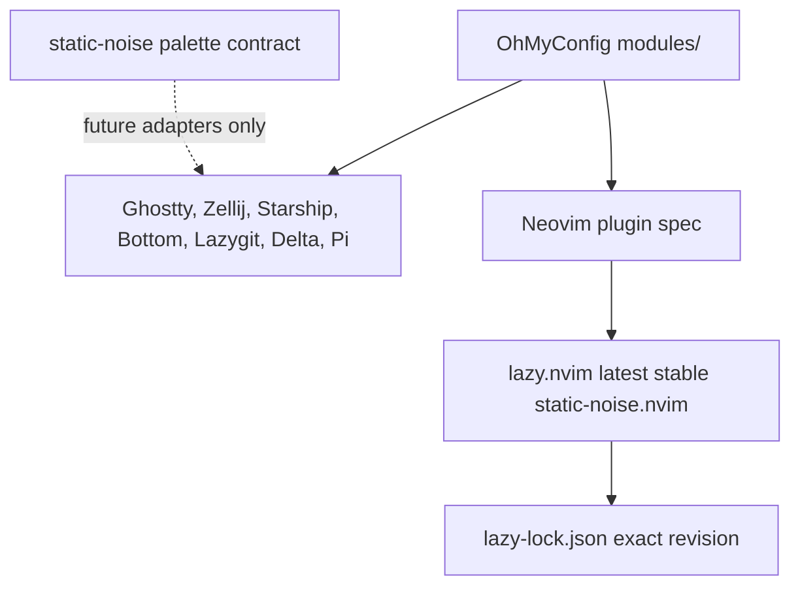

## Goal Capsule

- **Objective:** OhMyConfig conserva la apariencia visual actual de sus herramientas y actualiza Neovim mediante el único adaptador oficial disponible.
- **Means:** Versionar localmente las configuraciones visuales que antes llegaban desde artefactos remotos de Static Noise y gestionar `static-noise.nvim` mediante su última release estable compatible.
- **Product authority:** El alcance revisado por el usuario prevalece sobre el contrato anterior cuando limita la adaptación a Neovim.
- **Stop conditions:** No se crean adaptadores nuevos para otras herramientas ni se rediseñan sus colores actuales.
- **Release posture:** El reinicio fija OhMyConfig en `0.0.1` y no conserva compatibilidad con instalaciones anteriores.
- **Who finishes:** La implementación debe dejar el flujo de instalación/actualización, el módulo Neovim y la documentación coherentes con esta separación.

---

## Product Contract

### Summary

Este plan conserva como réplica local la configuración visual vigente de cada herramienta de OhMyConfig porque `static-noise` ya no genera configuraciones por herramienta. Neovim es la única excepción: usará `static-noise.nvim` como adaptador y seguirá la última release estable publicada.

### Problem Frame

El diseño actual de OhMyConfig descarga durante `install` y `update` una caché de archivos generados desde `hcastillaq/static-noise`, pero el repositorio fuente ahora publica un contrato de tokens y no mantiene esos artefactos por herramienta. La caché puede dejar de existir o divergir sin que OhMyConfig tenga control sobre el contenido que instala.

Neovim ya tiene una integración funcional con `static-noise.nvim`, pero su especificación no expresa que deba consumir releases estables y el lockfile todavía apunta a una revisión anterior de `main`. Además, la documentación describe un flujo remoto que dejará de ser válido para el resto de herramientas.

### Key Decisions

- **La configuración visual actual se conserva sin rediseño para herramientas sin adaptador** (session-settled: user-directed — elegida sobre recalibrar la paleta o crear adaptadores temporales: el objetivo inmediato es preservar el estado visual conocido mientras se escriben adaptadores independientes).
- **Neovim es la única herramienta que adopta un adaptador en esta revisión** (session-settled: user-directed — elegido sobre migrar también las demás herramientas: `static-noise.nvim` ya existe y las otras integraciones aún no están escritas).
- **Las configuraciones no-Neovim pasan a ser archivos locales versionados** (session-settled: user-directed — elegido sobre continuar descargando artefactos o generar una caché interna: OhMyConfig debe controlar exactamente lo que despliega).
- **La fuente de actualización de Neovim será la última release estable de `static-noise.nvim`** (session-settled: user-directed — elegido sobre seguir `main`: una release publicada ofrece una revisión estable y trazable).
- **OhMyConfig se reinicia en versión `0.0.1` sin compatibilidad hacia atrás** (session-settled: user-directed — elegido sobre una migración conservadora: la herramienta solo tiene un usuario y permite limpiar el diseño sin preservar instalaciones previas).

### Requirements

**Integración local de herramientas**

- R1. Las herramientas que actualmente consumen artefactos remotos conservarán una réplica local de su configuración visual vigente.
- R2. La réplica local debe mantener los valores, roles y comportamiento visual actuales, sin introducir una recalibración de color en este plan.
- R3. Los manifests deben resolver esas configuraciones desde `modules/` y no desde una caché remota o una descarga durante la instalación.

**Adaptador de Neovim**

- R4. Neovim debe continuar cargando `hcastillaq/static-noise.nvim` como su colorscheme.
- R5. La especificación de Neovim debe seleccionar la última release estable compatible del adaptador, excluyendo commits de desarrollo y prereleases.
- R6. El lockfile debe registrar la revisión exacta instalada después de actualizar el adaptador.
- R7. La configuración debe seguir funcionando con la versión estable actual de Neovim y con las APIs usadas por el adaptador.

**CLI, mantenimiento y documentación**

- R8. `omc install` y `omc update` no deben depender de `static_noise_prepare` ni desplegar artefactos generados remotos para las herramientas no-Neovim.
- R9. La actualización de Neovim debe permanecer integrada en el flujo de instalación y actualización del módulo editor.
- R10. La documentación debe distinguir el contrato de tokens de Static Noise, las configuraciones locales de OhMyConfig y el adaptador independiente de Neovim.
- R11. La auditoría final no debe dejar referencias activas que afirmen que Static Noise genera o distribuye configuraciones para todas las herramientas.
- R12. La versión del proyecto y de la documentación debe reiniciarse a `0.0.1` como nueva base operativa.
- R13. La implementación no debe mantener rutas de migración, compatibilidad o recuperación específicas para la versión anterior.

### Success Criteria

- Una instalación limpia obtiene las configuraciones visuales no-Neovim únicamente desde el repositorio de OhMyConfig.
- Una actualización no necesita descargar `dist/` ni una caché de Static Noise para desplegar Ghostty, Zellij, Starship, Bottom, Lazygit, Delta o Pi.
- Neovim se instala con la release estable más reciente de `static-noise.nvim` disponible al actualizar y el lockfile refleja esa revisión.
- La apariencia de cada herramienta no-Neovim permanece igual a la configuración vigente antes de la migración.
- La documentación no promete artefactos generados que el repositorio `static-noise` ya no publica.

### Scope Boundaries

- No se crean adaptadores para Ghostty, Zellij, Starship, Fish, Bottom, Lazygit, Delta, Pi, Atuin, Gum ni la documentación.
- No se rediseñan ni recalibran los colores actuales de las herramientas no-Neovim.
- No se construye un generador interno de configuraciones a partir de `palette.json`.
- No se modifica el contrato de tokens en el repositorio externo `static-noise`.
- No se mantiene compatibilidad con perfiles, cachés o destinos generados por versiones anteriores de OhMyConfig.

#### Deferred to Follow-Up Work

- Escribir adaptadores independientes para cada herramienta cuando el proyecto Static Noise defina el contrato y el mantenimiento correspondientes.
- Automatizar la sincronización de snapshots del contrato de tokens con procedencia y validación por adaptador.

### Dependencies / Assumptions

- La configuración actual desplegada por los artefactos remotos está disponible en el árbol de trabajo, en la caché local o en el historial suficiente para reproducirla sin reinterpretar sus colores.
- `static-noise.nvim` mantiene tags SemVer y su release estable actual es compatible con Neovim 0.9 o superior; la compatibilidad concreta con la versión instalada debe comprobarse durante la implementación.
- `lazy.nvim` permite solicitar la última release estable con una restricción SemVer y continúa registrando la revisión resuelta en `lazy-lock.json`.

### Sources / Research

- `hcastillaq/static-noise` README y `docs/consumers.md`: el repositorio publica `palette.json`, no configuraciones por herramienta; cada adaptador debe mantener su snapshot, conversión, compatibilidad y release.
- `hcastillaq/static-noise` `RELEASING.md`: los consumidores deben registrar tag y commit del contrato; al momento de la investigación existe el tag `v0.0.1`, pero no una GitHub Release publicada.
- `hcastillaq/static-noise.nvim` README, `VERSION` y workflow de release: la release vigente es `v0.0.1`, con soporte declarado para Neovim 0.9+ y publicación por tag.
- `modules/editor/nvim/lua/plugins/colorscheme.lua`: integración existente con `static-noise.nvim` y `colorscheme = "static-noise"`.
- `modules/editor/nvim/lazy-lock.json`: el adaptador está bloqueado actualmente a una revisión anterior de `main`.
- `cli/lib/static_noise.sh`, `cli/lib/deploy.sh`, `cli/commands/install.sh` y `cli/commands/update.sh`: puntos actuales de descarga, caché, despliegue y actualización de Neovim.
- `folke/lazy.nvim` documentación de versionado: `version = "*"` selecciona la última release SemVer estable y excluye prereleases; el lockfile conserva la revisión instalada.

---

## Planning Contract

### Product Contract Preservation

Product Contract revised by explicit user direction: R1-R11 reemplazan el alcance anterior que trataba a Static Noise como generador de configuraciones para todas las herramientas. Se conserva la intención visual de preservar Static Noise, pero se limita la implementación de adaptadores a Neovim.

### Key Technical Decisions

- KTD1. **Convertir los targets `@static-noise/*` en archivos locales del módulo correspondiente** — preserva exactamente la configuración visual vigente y elimina la dependencia runtime de un repositorio externo (Governs R1, R2, R3, R8).
- KTD2. **Eliminar la ruta de preparación y despliegue de artefactos remotos no-Neovim** — evita mantener una caché cuyo proveedor ya no ofrece esos artefactos (Governs R3, R8, R11).
- KTD3. **Solicitar la release estable de `static-noise.nvim` mediante SemVer y conservar el commit resuelto en el lockfile** — combina actualización automática hacia la última release con instalaciones reproducibles entre actualizaciones (Governs R4, R5, R6).
- KTD4. **Mantener la actualización del adaptador dentro del flujo existente de `omc`** — evita que el módulo editor quede actualizado solo cuando el usuario conoce comandos internos de LazyVim (Governs R7, R9).
- KTD5. **Tratar el snapshot local como configuración temporal, no como adaptador** — evita que una réplica de valores actuales se convierta accidentalmente en una nueva API de sincronización antes de que exista un adaptador mantenible.
- KTD6. **Reiniciar la base de versión y limpiar compatibilidad anterior** — reduce el alcance del cambio y evita conservar código de migración que no aporta valor para el único usuario actual (Governs R12, R13).

### High-Level Technical Design

OhMyConfig será la fuente de despliegue para las herramientas no-Neovim. El repositorio externo `static-noise` queda como referencia conceptual y fuente futura para adaptadores, no como dependencia de instalación. Neovim mantiene una dependencia externa explícita porque su adaptador ya existe y tiene release propia.

### System-Wide Impact

- El instalador deja de requerir conectividad con `static-noise` para completar módulos visuales no-Neovim.
- El modo `copy` y el modo `symlink` deben producir el mismo resultado a partir de fuentes locales.
- `omc update` conserva la actualización del plugin de Neovim, pero deja de actualizar o desplegar una caché de colores.
- La documentación de instalación, Neovim y las referencias de Static Noise deben explicar dos responsabilidades distintas: configuración local de OhMyConfig y adaptador publicado para Neovim.

### Risks & Dependencies

- Los artefactos remotos pueden no tener una copia idéntica dentro del repositorio; antes de implementar se debe recuperar su contenido desde la caché, historial o última respuesta válida y registrar cualquier diferencia como bloqueo.
- Cambiar la resolución de manifests puede dejar archivos obsoletos desplegados en instalaciones anteriores; la implementación debe decidir cómo retirar targets remotos sin borrar configuraciones de usuario fuera de la política de backups.
- `version = "*"` depende de que `static-noise.nvim` publique tags SemVer válidos; si la release más reciente rompe la compatibilidad con la versión instalada de Neovim, la implementación debe registrar el bloqueo en lugar de seleccionar `main` silenciosamente.
- El lockfile cambiará potencialmente por la actualización del adaptador y puede incluir revisiones transitivas de LazyVim; debe revisarse para distinguir cambios necesarios de ruido no relacionado.

### Assumptions

- La réplica local representa el estado visual vigente solicitado por el usuario, no una nueva calibración contra el `palette.json` actual.
- La frase “última release” para Neovim se interpreta como la última release estable de `static-noise.nvim`, no como un seguimiento de commits de desarrollo.
- El reinicio de versión es intencional y permite eliminar compatibilidad con el estado anterior porque no existen consumidores externos que deban migrarse.

---

## Implementation Units

### U1. Consolidar las configuraciones visuales locales

- **Goal:** Reemplazar cada target remoto por la réplica local exacta de la configuración visual vigente.
- **Requirements:** R1, R2, R3.
- **Dependencies:** None.
- **Files:** `modules/terminal/ghostty/manifest.sh`, `modules/terminal/ghostty/themes/static-noise`, `modules/terminal/zellij/manifest.sh`, `modules/terminal/zellij/themes/static-noise.kdl`, `modules/terminal/zellij/layouts/default.kdl`, `modules/core/starship/manifest.sh`, `modules/core/starship/starship.toml`, `modules/cli/bottom/manifest.sh`, `modules/cli/bottom/bottom.toml`, `modules/editor/lazygit/manifest.sh`, `modules/editor/lazygit/config.yml`, `modules/editor/git/manifest.sh`, `modules/editor/git/static-noise.gitconfig`, `modules/ai/pi/manifest.sh`, `modules/ai/pi/themes/static-noise.json`.
- **Approach:**
  1. Recuperar cada contenido vigente desde la caché, historial o fuente actualmente desplegada.
  2. Guardarlo bajo el módulo que ya lo consume.
  3. Cambiar cada manifest para apuntar al archivo local equivalente.
  4. Mantener Fish y cualquier configuración que ya sea local sin cambios visuales.
- **Patterns to follow:** Manifests existentes y despliegue no destructivo de `cli/lib/deploy.sh`.
- **Test scenarios:**
  - Para cada módulo, la fuente local produce el mismo contenido que el artefacto vigente antes de la migración.
  - En modo symlink, el destino apunta al archivo local de OhMyConfig y no a la caché.
  - En modo copy, el destino se actualiza desde la fuente local sin sobrescribir silenciosamente cambios del usuario.
- **Verification:** La búsqueda de `@static-noise/` no encuentra targets activos en manifests y el diff de cada archivo local demuestra que no hubo recalibración visual.

### U2. Retirar la dependencia runtime de artefactos remotos

- **Goal:** Simplificar instalación y actualización para que Static Noise no sea una descarga obligatoria para herramientas no-Neovim.
- **Requirements:** R3, R8, R9, R11.
- **Dependencies:** U1.
- **Files:** `cli/lib/static_noise.sh`, `cli/lib/deploy.sh`, `cli/commands/install.sh`, `cli/commands/update.sh`, `cli/lib/catalog.sh`.
- **Approach:**
  1. Retirar la preparación de caché y el recorrido especial de targets remotos.
  2. Conservar solo la responsabilidad necesaria para actualizar `static-noise.nvim`.
  3. Mantener el flujo existente de módulos y perfiles sin una fase de descarga de colores.
  4. Actualizar mensajes de éxito, warning y error para describir fuentes locales.
- **Execution note:** Es una migración de instalación y configuración; priorizar pruebas de sintaxis y smoke tests del CLI antes de cualquier ajuste cosmético.
- **Patterns to follow:** Separación actual entre `deploy_module` y acciones posteriores de instalación.
- **Test scenarios:**
  - `omc install` completa los módulos seleccionados sin `curl` ni caché de Static Noise.
  - `omc update` no falla cuando no existe conectividad con GitHub para el núcleo de Static Noise.
  - Un perfil existente en modo copy o symlink continúa desplegando las fuentes locales.
  - La actualización de Neovim conserva su warning controlado cuando Neovim no está instalado.
- **Verification:** `bash -n` pasa para los scripts modificados, los mensajes no mencionan artefactos generados no existentes y no quedan llamadas activas a `static_noise_prepare` ni `deploy_static_noise_artifacts`.

### U3. Actualizar Neovim al adaptador estable vigente

- **Goal:** Instalar y bloquear la última release estable de `static-noise.nvim` compatible con la versión actual de Neovim.
- **Requirements:** R4, R5, R6, R7, R9.
- **Dependencies:** None.
- **Files:** `modules/editor/nvim/lua/plugins/colorscheme.lua`, `modules/editor/nvim/lazy-lock.json`, `modules/editor/nvim/lua/config/lazy.lua`, `apps/docs/src/content/docs/neovim.md`.
- **Approach:**
  1. Expresar en la especificación del plugin la política de última release estable, excluyendo `main` y prereleases.
  2. Actualizar el lockfile a la revisión correspondiente a la release estable vigente.
  3. Revisar la configuración contra la versión estable actual de Neovim y las APIs usadas por el adaptador.
  4. Mantener transparencia, prioridad de carga y `colorscheme = "static-noise"` salvo incompatibilidad comprobada.
- **Patterns to follow:** Lockfile versionado de LazyVim y especificación existente del colorscheme.
- **Test scenarios:**
  - Con una release estable disponible, la resolución selecciona el tag estable más reciente y no un commit de `main`.
  - Neovim arranca en modo headless con el plugin bloqueado y carga el colorscheme sin errores Lua.
  - La configuración sigue funcionando con `termguicolors`, transparencia y los plugins visuales existentes.
  - Una futura release estable actualiza el lockfile al ejecutar la actualización sin convertir el plugin en una dependencia no versionada.
- **Verification:** El lockfile contiene la revisión de la release adoptada, Neovim reporta la versión soportada por el plan y no quedan instrucciones que recomienden seguir la rama mutable para este adaptador.

### U4. Sincronizar la documentación con el nuevo modelo

- **Goal:** Documentar con precisión qué vive localmente en OhMyConfig y qué se actualiza desde un adaptador externo.
- **Requirements:** R10, R11.
- **Dependencies:** U1, U2, U3.
- **Files:** `apps/docs/src/content/docs/instalacion.md`, `apps/docs/src/content/docs/neovim.md`, `apps/docs/src/content/docs/ai.md`, `apps/docs/src/content/docs/terminal.md`, `apps/docs/src/content/docs/git.md`, `apps/docs/src/content/docs/zellij.md`, `README.md`, `AGENTS.md`.
- **Approach:** Eliminar la afirmación de que `static-noise` genera y descarga configuraciones para todas las herramientas; explicar que las réplicas no-Neovim se mantienen en el repositorio; describir `static-noise.nvim` como el único adaptador activo y registrar su política de release.
- **Patterns to follow:** Documentación canónica bajo `apps/docs/src/content/docs/` y separación entre configuración y guía de instalación.
- **Test scenarios:**
  - La documentación de instalación no promete una caché o `dist/` remoto para herramientas no-Neovim.
  - La documentación de Neovim identifica el adaptador y su política de release estable.
  - Las páginas de herramientas continúan describiendo su apariencia actual sin introducir colores nuevos.
- **Verification:** La búsqueda de afirmaciones sobre artefactos generados remotos devuelve solo referencias históricas justificadas o ninguna referencia activa.

### U5. Auditar instalación, compatibilidad y drift

- **Goal:** Cerrar la migración demostrando que la configuración local conserva el comportamiento y que Neovim es la única integración versionada externamente.
- **Requirements:** R1-R11.
- **Dependencies:** U1, U2, U3, U4.
- **Files:** `cli/lib/static_noise.sh`, `cli/lib/deploy.sh`, `modules/*/*/manifest.sh`, `modules/editor/nvim/lazy-lock.json`, `apps/docs/src/content/docs/`.
- **Approach:** Auditar manifests, referencias remotas, nombres de temas, procedencia del lockfile y documentación; comparar los archivos locales con las configuraciones vigentes; validar que no se haya añadido una adaptación visual accidental.
- **Test scenarios:**
  - La búsqueda de `@static-noise/` no devuelve targets activos.
  - La búsqueda de frases que atribuyen generación de configuraciones a `static-noise` no devuelve documentación activa incorrecta.
  - Cada herramienta no-Neovim conserva su archivo local esperado y cada destino del manifest existe.
  - Neovim carga el adaptador releaseado y el lockfile identifica su revisión exacta.
  - La instalación funciona sin la caché remota y la actualización sigue intentando actualizar únicamente el adaptador de Neovim.
- **Verification:** Se completan validaciones de Bash, JSON, TOML/KDL/YAML donde haya parsers disponibles, smoke tests de `omc` y Neovim, y build de la documentación sin enlaces rotos.

### U6. Reiniciar la versión pública de OhMyConfig

- **Goal:** Establecer `0.0.1` como nueva base del proyecto y retirar la obligación de soportar la versión anterior.
- **Requirements:** R12, R13.
- **Dependencies:** U2, U4.
- **Files:** `VERSION`, `apps/docs/package.json`, `apps/docs/package-lock.json`, `omc`, `cli/commands/doctor.sh`, `README.md`, `AGENTS.md`.
- **Approach:** Actualizar la fuente única de versión y cualquier metadata derivada; revisar mensajes, documentación y políticas que todavía describan la versión anterior; eliminar referencias a compatibilidad o migración que ya no sean necesarias; no preservar perfiles o cachés antiguos dentro del flujo nuevo.
- **Test scenarios:**
  - `./omc --version` muestra `v0.0.1` y no usa un fallback de la versión anterior.
  - El build de documentación muestra `0.0.1` en sus metadatos derivados.
  - Un entorno limpio instala la nueva base sin ejecutar una migración de perfiles o cachés antiguos.
- **Verification:** El árbol activo usa `0.0.1` como versión del proyecto, las referencias a la versión anterior quedan limitadas a historial o planes, y no existe una ruta de compatibilidad activa.

---

## Verification Contract

| Check | Applies to | Done signal |
|---|---|---|
| Manifest/source audit | U1, U5 | No active manifest usa `@static-noise/*`; cada target local existe. |
| Bash syntax | U2, U5 | `bash -n omc cli/commands/*.sh cli/lib/*.sh` pasa. |
| Local configuration parity | U1, U5 | Los archivos locales coinciden con la configuración visual vigente registrada antes de la migración. |
| Neovim adapter resolution | U3 | Lazy.nvim resuelve la última release estable de `static-noise.nvim` y `lazy-lock.json` registra su commit. |
| Neovim headless smoke | U3, U5 | Neovim inicia y carga Static Noise sin errores Lua o de plugin. |
| Configuration syntax | U1, U5 | Los formatos soportados de Ghostty, Zellij, Starship, Bottom, Lazygit, Delta y Pi se validan cuando existe parser o binario disponible. |
| Documentation build | U4, U5 | `npm run build` dentro de `apps/docs` termina sin errores ni enlaces rotos. |
| Runtime install/update smoke | U2, U5 | `./omc --help`, instalación y actualización no dependen de `static-noise` remoto para las herramientas no-Neovim. |
| Version reset | U6 | `./omc --version` y los metadatos de documentación reportan `0.0.1`, sin migración de la versión anterior. |

---

## Definition of Done

- Las configuraciones visuales actuales de Ghostty, Zellij, Starship, Bottom, Lazygit, Delta y Pi están versionadas localmente en sus módulos.
- Los manifests ya no dependen de targets `@static-noise/*`.
- `omc install` y `omc update` no descargan ni despliegan una caché de artefactos Static Noise para herramientas no-Neovim.
- Neovim usa únicamente el adaptador `static-noise.nvim` como integración externa y queda actualizado a la última release estable compatible, con lockfile actualizado.
- La documentación diferencia claramente contrato de tokens, configuración local y adaptador de Neovim.
- Las pruebas de sintaxis, paridad, smoke tests y build documental pasan.
- OhMyConfig y la documentación quedan en versión `0.0.1`.
- No queda código de compatibilidad, migración o recuperación específico de la versión anterior.
- No queda código abandonado de la ruta remota ni una configuración experimental sin uso.
