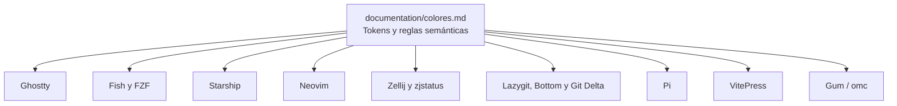
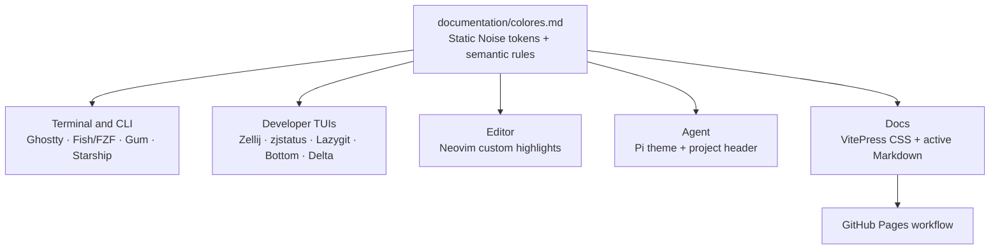

## Goal Capsule

- **Objective:** Todas las herramientas configuradas por OhMyConfig presentan una identidad visual única, legible y semánticamente consistente bajo el tema Static Noise.
- **Means:** Reemplazar Tokyonight por Static Noise y centralizar sus tokens y reglas semánticas en `documentation/colores.md`.
- **Product authority:** La fuente canónica será `documentation/colores.md`; `ohmyconfig-static-noise.md` sirve como guía de diseño de partida.
- **Open blockers:** Ninguno para la definición de requisitos.

## Product Contract

### Summary

Static Noise será el único tema oficial de OhMyConfig para terminal, editor, multiplexer, TUIs, agente Pi y documentación. La fuente canónica definirá tokens cromáticos y reglas semánticas, mientras cada herramienta aplicará esa semántica según su propio formato.

### Problem Frame

El repositorio mezcla valores Tokyonight base, variantes high-contrast y colores personalizados entre Ghostty, Fish, Neovim, Zellij y otras herramientas. Esa mezcla dificulta predecir qué significa foco, selección, éxito, advertencia, cambio o error al pasar de una interfaz a otra.

La guía `ohmyconfig-static-noise.md` propone una identidad visual nueva, pero todavía no es la referencia versionada ni está aplicada de forma uniforme. Mantener dos referencias cromáticas permitiría que futuras configuraciones vuelvan a divergir.

### Key Decisions

- **Propiedad y secuenciación clara para `documentation/ai.md`** (session-settled: user-directed — U5 es dueña de las rutas y especificaciones técnicas de Pi en `documentation/ai.md`; U6 depende explícitamente de U5 y actualiza la prosa general respetando las rutas ya migradas).
- **Jerarquía de estados combinados definida en el contrato canónico** (session-settled: user-directed — el foco activo siempre domina mediante acento cian y texto iluminado; selecciones inactivas usan fondo atenuado neutral; estados críticos como error o advertencia preservan su color en texto/símbolo mientras la selección se aplica exclusivamente al fondo para nunca opacar la alerta).
- **VitePress responsive aprovecha el sistema nativo con inyección de variables Static Noise** (session-settled: user-directed — preserva los breakpoints estándar de VitePress de 960px, navegación colapsable y modal de búsqueda nativos; mapea el cajón lateral y navbar a superficies neutras, mantiene un área táctil mínima de 44px para controles clave y garantiza scroll horizontal en bloques de código sin rotura de sintaxis).
- **Git Delta utiliza `syntax-theme = ansi`** (session-settled: user-directed — la sintaxis de los diffs hereda la paleta ANSI calibrada de Ghostty para total coherencia con Static Noise, sin temas externos ni discrepancias cromáticas).
- **Bat hereda la paleta ANSI de Ghostty** (session-settled: user-directed — se configura `BAT_THEME="ansi"` en `config/fish/config.fish` aprovechando la paleta de 16 colores calibrada en Ghostty, evitando dependencias de `.tmTheme` compilados o `bat cache`).
- **Neovim implementa Static Noise mediante un módulo Lua propio del repositorio** (session-settled: user-directed — elegido sobre un tema base con overrides para garantizar cero dependencias externas y control total sobre los highlights de editor, sintaxis, float, diagnósticos y Git).
- **Zjstatus adopta Static Noise directamente en el layout** (`config/zellij/layouts/default.kdl`): los formatos de tabs, modos e indicadores de la barra consumen tokens canónicos inline, mientras que el binario WASM se audita únicamente como superficie sin controles cromáticos propios independientes.
- **Static Noise reemplaza completamente a Tokyonight** (session-settled: user-directed — elegido sobre una capa de compatibilidad porque el objetivo es que no exista Tokyonight operativo). La mención de Tokyonight en esta fuente canónica es únicamente histórica y explica la sustitución; no constituye una referencia operativa.
- **`documentation/colores.md` será la única fuente canónica** (session-settled: user-directed — elegido sobre un archivo separado porque ya es la página de referencia cromática del proyecto).
- **La fuente canónica contendrá tokens y reglas semánticas, no bloques específicos de cada herramienta** (session-settled: user-directed — elegido sobre tokens más especificaciones para evitar duplicar configuraciones y crear otra superficie de divergencia).
- **La migración priorizará semántica y legibilidad sobre la reproducción literal de valores heredados**, usando la guía Static Noise como base de diseño.

### Requirements

**Fuente canónica del tema**

- R1. `documentation/colores.md` debe documentar la identidad visual de Static Noise y declarar que reemplaza a Tokyonight como tema oficial.
- R2. La fuente debe definir tokens primitivos para superficies, texto, bordes, foco, estados y acentos atenuados, con nombre, valor hexadecimal y uso previsto.
- R3. La fuente debe definir roles semánticos independientes de la herramienta para foco, selección, estructura, éxito, advertencia, modificación, error, información y elementos desactivados.
- R4. La fuente debe establecer reglas de contraste, jerarquía de superficies, uso de acentos, cursivas, glow y combinación de color con símbolos o etiquetas.
- R5. La fuente debe incluir variables portables y un checklist breve para evaluar futuras herramientas sin añadir configuraciones específicas de Ghostty, Neovim, Zellij, Pi u otra herramienta.

**Aplicación transversal**

- R6. Todas las configuraciones activas de Ghostty, Fish/FZF, Starship, Neovim, Zellij/zjstatus, Lazygit, Bottom, Git Delta, Gum/omc, Pi y VitePress deben adoptar Static Noise mediante equivalencias compatibles con cada formato.
- R7. Cada herramienta debe conservar la semántica global del tema: el foco debe usar el rol de foco, los estados deben conservar sus roles de éxito/advertencia/modificación/error y las selecciones deben seguir las reglas de selección definidas en R4.
- R8. Las configuraciones no deben introducir colores nuevos que compitan con los tokens canónicos, salvo una necesidad técnica documentada y compatible con la semántica de Static Noise.
- R9. La migración debe eliminar nombres de tema, comentarios y referencias operativas a Tokyonight en configuraciones y documentación activa.

**Mantenimiento y legibilidad**

- R10. La documentación del proyecto debe enlazar o referenciar `documentation/colores.md` como autoridad cromática cuando describa colores, temas o estilos.
- R11. Los estados críticos deben combinar color con un símbolo o etiqueta para no depender únicamente de la percepción cromática.
- R12. La aplicación debe reservar los fondos grandes para superficies neutrales y variantes atenuadas; los acentos brillantes deben quedar limitados a texto, iconos, cursores y bordes activos.

### Key Flows

No se incluye una sección de flujos porque el trabajo define un sistema visual y una migración de configuraciones, no un comportamiento interactivo con recorridos de usuario.

### Visualizations

La siguiente relación representa el contrato de fuente única y sus superficies derivadas.

### Acceptance Examples

- AE1. **Dado** cualquier configuración activa que aún identifique Tokyonight, **cuando** se complete la migración, **entonces** usa Static Noise y no conserva una referencia operativa a Tokyonight.
- AE2. **Dado** un estado de éxito, advertencia, modificación o error en una herramienta, **cuando** se renderiza, **entonces** usa el rol semántico correspondiente y un indicador no cromático cuando el estado sea crítico.
- AE3. **Dado** un elemento con foco y otro inactivo, **cuando** se muestran juntos, **entonces** el foco se distingue mediante el token de foco y el elemento inactivo no compite visualmente con él.
- AE4. **Dado** una nueva herramienta que se quiera añadir al catálogo, **cuando** se consulte `documentation/colores.md`, **entonces** se pueden elegir tokens y roles sin inventar una paleta paralela ni copiar una especificación de otra herramienta.

### Success Criteria

- La búsqueda de referencias operativas a `Tokyonight` en configuraciones y documentación activa no devuelve resultados no justificados.
- `documentation/colores.md` permite identificar cada token, su función semántica y sus restricciones sin consultar una configuración concreta.
- Las herramientas incluidas en R6 muestran una apariencia coherente: superficies oscuras neutrales, foco cian, estructura azul/púrpura/rosa y estados verde/amarillo/naranja/rojo.
- La documentación de VitePress se compila correctamente y no introduce enlaces rotos después de la actualización.
- Un revisor puede verificar la migración comparando cada configuración con la fuente canónica, sin tener que resolver qué versión de Tokyonight prevalece.

### Scope Boundaries

- No se creará un generador automático de configuraciones.
- No se mantendrán alias ni una capa de compatibilidad Tokyonight.
- No se añadirá una especificación por herramienta dentro de `documentation/colores.md`.
- La migración cubre las herramientas y superficies ya identificadas en R6; incorporar nuevas herramientas será trabajo posterior y deberá seguir R5.

### Dependencies / Assumptions

- Las herramientas mantienen sus propias sintaxis y limitaciones de color; Static Noise define significado y selección de tokens, no un formato universal de configuración.
- Las configuraciones actuales listadas en `documentation/colores.md`, `AGENTS.md` y el catálogo de Pi representan el inventario inicial que debe auditarse.
- La accesibilidad se evaluará mediante contraste visual y redundancia semántica; las herramientas que no soporten undercurl, símbolos o todos los colores deberán conservar la intención con las capacidades disponibles.

### Outstanding Questions

- **Deferred to Planning:** determinar la traducción exacta de cada token a la sintaxis y capacidades de cada herramienta.
- **Deferred to Planning:** decidir si alguna configuración necesita una variante técnica de un token por limitaciones de ANSI, transparencia o temas nativos.

### Sources / Research

- `ohmyconfig-static-noise.md` — guía de diseño base con tokens, semántica, ANSI y principios de uso.
- `documentation/colores.md` — referencia cromática existente que será reemplazada.
- `AGENTS.md` — invariantes de paleta, documentación y despliegue del proyecto.
- `config/ghostty/config`, `config/fish/config.fish`, `config/starship/starship.toml`, `config/nvim/lua/plugins/colorscheme.lua`, `config/zellij/config.kdl`, `config/lazygit/config.yml`, `config/bottom/bottom.toml`, `config/git/delta.gitconfig`, `.pi/settings.json` y `config/pi/themes/ohmyconfig-tokyonight.json` — superficies de configuración identificadas para la migración.

## Planning Contract

### Product Contract Preservation

Product Contract unchanged. Planning adds implementation sequencing and verification without changing the settled product scope or R-IDs.

### Key Technical Decisions

- KTD1. **Use explicit Static Noise values in each native configuration** — preserves tool-native syntax and avoids introducing a generator that would become a second build system (Governs R2, R3, R6, R8).
- KTD2. **Remove Tokyonight dependencies and names rather than aliasing them** — satisfies the zero-operational-Tokyonight criterion and prevents future drift (Governs R1, R9).
- KTD3. **Treat tools without color controls as inventory-only surfaces** — Atuin and the Pi header are validated for compatibility but do not receive invented color settings (Governs R6, R8).
- KTD4. **Use smoke and syntax validation instead of unit tests for configuration-only changes** — the primary failure modes are invalid syntax, unsupported keys, stale paths and runtime load errors (Governs R6, R7, R10).

### High-Level Technical Design

Static Noise fans out from one semantic contract into native tool configurations. The source document owns meaning; implementation files own syntax and capability-specific translation.

### System-Wide Impact

- Runtime configuration changes affect shell startup, CLI output, editor rendering, terminal multiplexing, Git workflows, Pi sessions and published documentation.
- The `ai` catalog and `.pi/settings.json` must remain path-consistent after the Pi theme rename.
- `.github/workflows/docs.yml` must watch `documentation/**`, because the repository's VitePress source directory is `documentation` rather than `docs`.
- Atuin has no color controls in `config/atuin/config.toml`; it remains documented as inheriting terminal appearance rather than receiving unsupported settings.

### Risks & Dependencies

- Neovim currently depends on `folke/tokyonight.nvim`; removing it requires a complete replacement for the highlights it currently supplies before the lock entry is deleted.
- Zellij has colors in both `config/zellij/config.kdl` and inline in `config/zellij/layouts/default.kdl`; migrating only one leaves visible Tokyonight remnants.
- Fish and FZF accept different color formats, so shared token names must be translated without copying syntax between them.
- VitePress currently lacks a custom theme entry and CSS; its visual migration is a real configuration addition, not only a metadata rename.
- The untracked `ohmyconfig-static-noise.md` must be incorporated and then removed or clearly marked historical so it cannot become a second authority.

### Documentation / Operational Notes

- Update `AGENTS.md`, `README.md`, `.vitepress/config.mjs`, `documentation/ai.md`, `documentation/cheatsheet.md`, `documentation/git.md`, `documentation/herramientas.md`, `documentation/neovim.md`, `documentation/terminal.md`, `documentation/zellij.md` and any active references found by the repository-wide audit.
- Update the VitePress workflow path filter and retain the existing `srcDir: "documentation"` arrangement.
- Keep per-tool syntax and mapping details in the configurations or tool-specific guides; `documentation/colores.md` remains token- and rule-focused.

## Implementation Units

### U1. Establish the Static Noise contract

- **Goal:** Replace the Tokyonight reference page with the canonical Static Noise token and semantic-rule contract.
- **Requirements:** R1, R2, R3, R4, R5, R10.
- **Dependencies:** None.
- **Files:** `documentation/colores.md`, `ohmyconfig-static-noise.md`.
- **Approach:** Consolidate the guide's reviewed palette, clarify primitive versus semantic roles, document selection versus `cyanDim`, define hierarchical priority for combined states (active focus with radiant cyan vs inactive selection with dimmed background; critical error/warning states retain foreground color while selection only styles the background), define accessibility and state rules, add portable variables and the new-tool checklist, then remove the duplicate untracked guide or mark it explicitly as historical outside the authority path.
- **Test scenarios:** Test expectation: none — this unit produces documentation; verify every token has a value and semantic role, and no per-tool configuration block remains in the canonical page.
- **Verification:** A reader can select a token from `documentation/colores.md` without consulting another theme file. Record minimum contrast targets, allowed exceptions, required foreground/background pairs, and an automated check covering normal and large text, UI controls, focus indicators, selections, code blocks and alerts.

### U2. Migrate terminal, shell and CLI surfaces

- **Goal:** Apply Static Noise to the terminal, shell completion/search interfaces and `omc` Gum output.
- **Requirements:** R6, R7, R8, R9, R11, R12.
- **Dependencies:** U1.
- **Files:** `config/ghostty/config`, `config/fish/config.fish`, `config/starship/starship.toml`, `cli/lib/ui.sh`.
- **Approach:** Replace the native Ghostty theme with explicit Static Noise values (including full 16-color ANSI palette), configure `BAT_THEME="ansi"` in Fish so `bat` seamlessly inherits the Ghostty ANSI palette without binary theme caches, translate tokens to Fish's no-`#` syntax and FZF's full-hex syntax, map Starship segments by semantic role, and align Gum's exported `COLOR_*` roles with the same state grammar.
- **Test scenarios:** Test expectation: none — configuration-only unit; syntax-check Fish and Bash, inspect `omc --help`, and confirm no Tokyonight name or value remains in these files.
- **Verification:** Shell startup, FZF selection, Starship prompt and `omc` output use neutral surfaces, cian focus and the agreed state colors without syntax errors.

### U3. Migrate developer TUIs and Git presentation

- **Goal:** Apply Static Noise to Zellij, zjstatus, Lazygit, Bottom and Git Delta.
- **Requirements:** R6, R7, R8, R9, R11, R12.
- **Dependencies:** U1.
- **Files:** `config/zellij/config.kdl`, `config/zellij/layouts/default.kdl`, `config/lazygit/config.yml`, `config/bottom/bottom.toml`, `config/git/delta.gitconfig`.
- **Approach:** Migrate both Zellij color surfaces (palette tokens in `config.kdl` and full status-bar ANSI/KDL tokens in `layouts/default.kdl` so zjstatus maintains complete visual alignment with Static Noise), set `syntax-theme = ansi` in `config/git/delta.gitconfig` to inherit Ghostty's calibrated ANSI palette for syntax highlighting in diffs, use `Dim` variants for diff and selection backgrounds, preserve active/inactive focus hierarchy, keep critical states symbol-backed, and retain the existing Git/Delta integration behavior.
- **Test scenarios:** Test expectation: none — configuration-only unit; parse each supported configuration where tooling permits and smoke-test Zellij, Lazygit, Bottom and Delta when installed.
- **Verification:** Active panes and selections are visually dominant, inactive borders remain subordinate, diffs use subdued backgrounds, and Git states retain their semantic colors.

### U4. Replace the Neovim theme implementation

- **Goal:** Remove the Tokyonight Neovim dependency and provide Static Noise highlights with equivalent editor usability.
- **Requirements:** R6, R7, R8, R9, R11, R12.
- **Dependencies:** U1.
- **Files:** `config/nvim/lua/plugins/colorscheme.lua`, `config/nvim/lua/config/lazy.lua`, `config/nvim/lazy-lock.json`.
- **Approach:** Replace the Tokyonight plugin configuration with a repository-owned Lua colorscheme module (`config/nvim/lua/plugins/colorscheme.lua`) implementing Static Noise directly via native Neovim highlights (`nvim_set_hl`), remove `tokyonight-night` from the LazyVim install fallback in `config/nvim/lua/config/lazy.lua`, preserve transparency and focus behavior where compatible, and remove the obsolete plugin lock entry only after the replacement covers editor, float, selection, diagnostic, syntax and Git roles.
- **Test scenarios:** Test expectation: none — configuration-only unit; launch Neovim headless with the deployed configuration and verify it loads without plugin-resolution or Lua errors.
- **Verification:** Neovim starts without Tokyonight, syntax and diagnostics remain distinguishable, and the active line, visual selection, cursor and floats follow Static Noise roles.

### U5. Rename and migrate the Pi theme

- **Goal:** Make Pi use a Static Noise theme while keeping its local header and catalog paths functional.
- **Requirements:** R6, R7, R8, R9, R10.
- **Dependencies:** U1.
- **Files:** `.pi/settings.json`, `config/pi/themes/ohmyconfig-tokyonight.json`, `config/pi/themes/ohmyconfig-static-noise.json`, `config/pi/extensions/ohmyconfig-header.ts`, `cli/lib/catalog.sh`, `documentation/ai.md`.
- **Approach:** Rename the theme file and internal theme name, translate its existing `vars` and semantic role mappings to Static Noise, update settings and catalog references, and validate that the header consumes supported semantic roles rather than hardcoded Tokyonight names.
- **Test scenarios:** Test expectation: none — JSON and extension configuration unit; validate JSON syntax, inspect settings-to-theme paths, and smoke-test Pi with project-local theme loading when installed.
- **Verification:** Pi loads the renamed theme and header through `.pi/settings.json`, and the catalog deploys the same path that settings reference.

### U6. Apply Static Noise to VitePress and active documentation

- **Goal:** Make the published documentation visually use Static Noise and remove active Tokyonight messaging.
- **Requirements:** R6, R9, R10, R12.
- **Dependencies:** U1, U5.
- **Files:** `.vitepress/config.mjs`, `.vitepress/theme/index.js`, `.vitepress/theme/custom.css`, `.github/workflows/docs.yml`, `README.md`, `AGENTS.md`, `documentation/ai.md`, `documentation/cheatsheet.md`, `documentation/git.md`, `documentation/herramientas.md`, `documentation/neovim.md`, `documentation/terminal.md`, `documentation/zellij.md`, `documentation/instalacion.md`, `documentation/index.md`.
- **Approach:** Add the smallest VitePress theme entry and CSS needed to map page, navigation, code, link, selection and alert roles; explicitly define `:focus-visible`, hover, current/visited links, active sidebar items, skip links, mobile navigation (respecting native 960px breakpoint with 44px touch targets and horizontal scroll for code blocks), search input/modal/no-results, code-copy success/error, alerts, semantic HTML/ARIA preservation and reduced-motion behavior; update metadata and prose to Static Noise; correct the workflow path filter; preserve pure Markdown under `documentation/`.
- **Test scenarios:** Test expectation: none — documentation/configuration unit; build VitePress and verify every documented color reference uses Static Noise terminology or an intentional historical note.
- **Verification:** VitePress renders the Static Noise surfaces, the Pages workflow responds to changes under `documentation/**`, and active docs no longer instruct users to use Tokyonight.

### U7. Audit unsupported and residual surfaces

- **Goal:** Close the migration by checking all active references and documenting surfaces that cannot receive colors.
- **Requirements:** R6, R8, R9, R10.
- **Dependencies:** U2, U3, U4, U5, U6.
- **Files:** `config/atuin/config.toml`, `config/pi/extensions/ohmyconfig-header.ts`, `config/nvim/lazyvim.json`, `config/zellij/plugins/zjstatus.wasm`.
- **Approach:** Confirm Atuin and the WASM plugin do not expose independent palette controls, validate the Pi header and LazyVim extras do not retain stale theme references, and run a repository-wide case-insensitive Tokyonight audit excluding intentional historical or plan content.
- **Test scenarios:** Test expectation: none — audit unit; record each surface as migrated, inherited, unsupported or intentionally historical, with no unclassified active reference left behind.
- **Verification:** The final audit produces no unjustified `tokyonight` or `tokyo night` reference in active configuration or documentation.

## Verification Contract

| Check | Applies to | Done signal |
|---|---|---|
| Repository-wide theme audit | U1–U7 | No unjustified Tokyonight reference remains in active files. Historical replacement mentions are explicitly allowed only in the canonical contract. |
| Markdown and diff hygiene | U1, U6 | `git diff --check` passes and Markdown remains pure. |
| Fish syntax | U2 | `fish -n config/fish/config.fish` passes. |
| Bash syntax | U2 | `bash -n omc cli/commands/*.sh cli/lib/*.sh` passes. |
| JSON validity | U5 | `jq empty .pi/settings.json config/pi/themes/*.json` passes. |
| VitePress build | U6 | `npx vitepress build` completes without Rollup or broken-link errors. |
| Runtime smoke checks | U2–U6 | Available binaries load their updated configuration: `./omc --help`, Neovim headless, Zellij, Bottom, Lazygit, Delta and Pi. |

Add a lightweight canonical-token drift check to the audit: read the token values from `documentation/colores.md` and reject stale or unapproved values in migrated surfaces without generating native configuration files. The repository has no `package.json`; VitePress verification may use the existing ephemeral install workflow rather than introducing a JavaScript dependency manifest unless implementation finds a maintenance reason to add one.

## Implementation Obligations

None remaining. All architectural contradictions, tool mechanisms, and dependency boundaries have been incorporated into the unified plan.

## Deferred / Open Questions

None. All 7 review decisions (zjstatus layout integration, Neovim repository-owned Lua module, Bat ANSI inheritance, Delta ANSI syntax, VitePress native responsive variables, combined state hierarchy, and U5/U6 sequence) have been settled and captured in Key Decisions and Implementation Units.

## Definition of Done

- `documentation/colores.md` is the only canonical Static Noise source and contains tokens, semantic roles, rules, variables and the new-tool checklist.
- All surfaces in R6 are migrated or explicitly documented as lacking color controls.
- Tokyonight is absent from active configuration, documentation and runtime names; any retained historical mention is clearly non-operational.
- Neovim and Pi no longer depend on or reference Tokyonight assets.
- VitePress and its GitHub Pages workflow reflect the actual `documentation/` source directory.
- Syntax checks, VitePress build, available runtime smoke checks and repository-wide audit pass.
- No duplicate theme guide or abandoned experimental file remains in the final diff.
