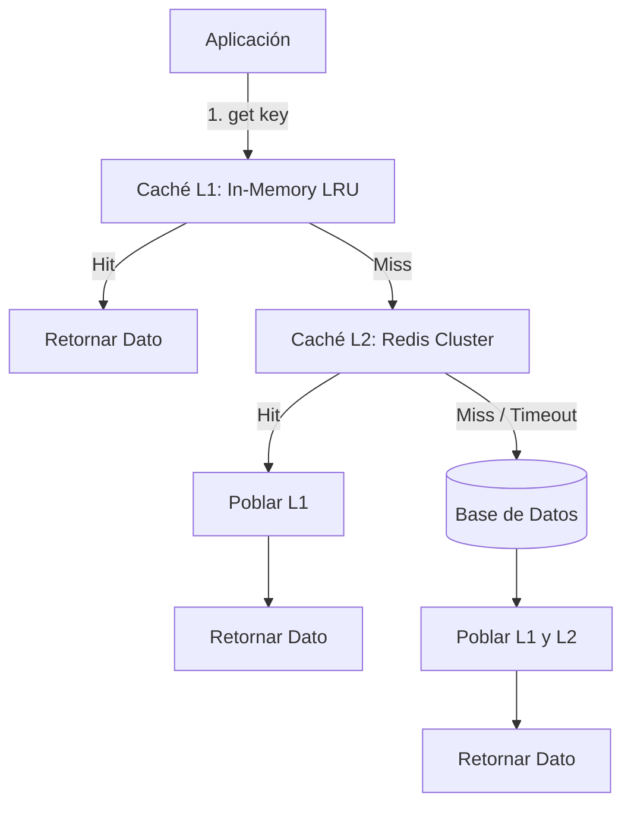

# 🤖 Ecosistema AI & Coding Agents (LazyPi)

OhMyConfig integra un entorno de **ingeniería de software asistida por Inteligencia Artificial y agentes autónomos de código** directamente en la terminal. El enfoque es modular, riguroso y minimalista: la CLI `omc` instala y mantiene el agente base (**`pi`**), complementado por la suite oficial **LazyPi** ([lazypi.org](https://lazypi.org)), el framework **Compound Engineering (CE)** y la disciplina de **Spec-Driven Development (SDD / OpenSpec)**.

---

## 1. Manifiesto & Arquitectura del Ecosistema

La filosofía de LazyPi en OhMyConfig se inspira en el modelo de LazyVim: **un núcleo preconfigurado y mantenido por la comunidad con un catálogo curado de 17 herramientas de alto rendimiento**:

1. **Cero código a ciegas:** Ningún cambio de arquitectura o funcionalidad no trivial debe programarse sin antes definir alcance, contratos de datos y diseño técnico.
2. **Memoria y conocimiento acumulativo:** Soluciones complejas y decisiones de diseño se guardan en notas técnicas Markdown versionadas en Git.
3. **Flujo de terminal puro y subagentes concurrentes:** Todo el ciclo de vida (análisis, planificación, edición, pruebas, revisión y commits) ocurre en la consola mediante subagentes coordinados en paralelo.

```
┌─────────────────────────────────────────────────────────────────────────────┐
│                         Terminal (Ghostty / Zellij)                         │
│                                                                             │
│   ┌─────────────────────────────────────────────────────────────────────┐   │
│   │                     pi (Coding Agent Base)                          │   │
│   │   • Agente autónomo de terminal para leer, editar y ejecutar        │   │
│   │   • Gestión de modelos: Anthropic Claude, OpenAI, Gemini, Ollama    │   │
│   │   • Instalado y actualizado automáticamente con: ./omc dev          │   │
│   └──────────────────────────────────┬──────────────────────────────────┘   │
│                                      │                                      │
│                ┌─────────────────────┼─────────────────────┐                │
│                ▼                     ▼                     ▼                │
│   ┌───────────────────────────┐┌───────────────────────────┐┌───────────────┐│
│   │   LazyPi Core (12 pkgs)   ││ LazyPi Optional (5 pkgs)  ││  OpenSpec SDD ││
│   │ • subagents & workflows   ││ • lsp (diagnósticos)      ││ • proposal.md ││
│   │ • ask-user & goal         ││ • interactive-shell (TUI) ││ • specs/      ││
│   │ • fff & web-access        ││ • memory-md (Git offline) ││ • design.md   ││
│   │ • simplify & ponytail     ││ • autoresearch (loops)    ││ • tasks.md    ││
│   │ • skillful & mention ($)  ││ • todos (checklist live)  ││ • docs/solut. ││
│   └───────────────────────────┘└───────────────────────────┘└───────────────┘│
└─────────────────────────────────────────────────────────────────────────────┘
```

---

## 2. Catálogo Oficial de Herramientas de LazyPi (17/17)

LazyPi divide sus herramientas en dos niveles de soporte para garantizar máxima velocidad y cero bloat:

### 2.1 LazyPi Core (12 Herramientas Principales)

| Herramienta | Paquete npm | Comando / Interacción | Propósito y Valor |
| :--- | :--- | :--- | :--- |
| **`subagents`** | `pi-subagents` | `subagent` tool / `/council` | Ejecuta agentes hijos en paralelo en worktrees aislados para tareas concurrentes. |
| **`pi-ask-user`** | `pi-ask-user` | `ask_user` tool | Despliega menús interactivos con selección estructurada antes de decisiones críticas. |
| **`pi-skillful`** | `pi-skillful` | `/skill:<nombre>` | Descubre, oculta y expande skills por encima del git root. |
| **`mention-skill`**| `@zigai/pi-mention-skill` | `$nombre-skill` | Autocompletado difuso con `$` para inyectar skills directamente en el prompt. |
| **`goal`** | `@narumitw/pi-goal` | `/goal` | Control de objetivos de largo plazo con detención en `done`, `blocked` o `wait`. |
| **`btw`** | `@narumitw/pi-btw` | `/btw <pregunta>` | Consultas rápidas al margen sin contaminar el historial de la conversación actual. |
| **`context-usage`**| `pi-context-usage` | Telemetría en footer | Muestra el consumo de tokens y presupuesto de contexto en tiempo real. |
| **`simplify`** | `pi-simplify` | `/simplify` | Revisa código modificado recientemente buscando claridad, consistencia y eliminación de código muerto. |
| **`web-access`** | `pi-web-access` | `web_search`, `source_check`| Búsqueda web multi-motor en tiempo real (Brave, Exa, Perplexity) y extracción de contenido. |
| **`fff`** | `@ff-labs/pi-fff` | `fffind`, `ffgrep`, `/fff-health`| Fast Fuzzy Finder ultrarrápido para búsqueda de archivos y símbolos. |
| **`dynamic-workflows`**| `@quintinshaw/pi-dynamic-workflows`| `/workflows` | Interfaz TUI para orquestar subagentes, deep-research y contabilidad de tokens. |
| **`ponytail`** | `@dietrichgebert/ponytail` | `/ponytail review`, `audit` | Guardián de disciplina de código minimalista y librerías estándar (*stdlib-first*). |

### 2.2 LazyPi Optional (5 Herramientas Avanzadas)

| Herramienta | Paquete npm | Comando / Interacción | Propósito y Valor |
| :--- | :--- | :--- | :--- |
| **`lsp`** | `@narumitw/pi-lsp` | `lsp_diagnostics`, `lsp_fix` | Diagnóstico de errores de compilación, sintaxis y tipos en vivo usando Language Servers. |
| **`interactive-shell`**| `pi-interactive-shell`| `interactive_shell` | Ejecuta TUIs y CLIs complejas en segundo plano (supervisadas o *hands-free*). |
| **`autoresearch`** | `pi-autoresearch` | `autoresearch-create` | Bucles autónomos de experimentación y optimización métrica con hooks. |
| **`todos`** | `pi-manage-todo-list`| `manage_todo_list` | Tracking estructurado de tareas en sesión con widgets visuales de progreso. |
| **`memory`** | `pi-memory-md` | `memory_search`, `tape_handoff`| Memoria episódica y semántica persistente en Markdown versionada en Git local. |

---

## 3. Cómo Configurar e Implementar SDD (Spec-Driven Development) con LazyPi

**Spec-Driven Development (SDD / OpenSpec)** es una metodología basada en el principio de que **las especificaciones formales y el diseño de arquitectura deben existir en disco antes de escribir código**.

Con LazyPi, SDD no requiere daemons externos ni middleware que bloquee la terminal. Se implementa de forma **100% nativa con archivos Markdown, subagentes y herramientas del catálogo**:

```
openspec/
├── config.yaml          # Metadatos del stack, comandos de test y convenciones
└── changes/             # Carpeta de cambios activos o archivados
    └── sistema-auth-jwt/
        ├── proposal.md  # 1. Motivación, alcance, criterios de éxito y non-goals
        ├── specs/       # 2. Especificaciones formales y contratos de interfaces
        │   ├── auth-contract.md
        │   └── session-schema.md
        ├── design.md    # 3. Decisiones de arquitectura, trade-offs y diagramas
        └── tasks.md     # 4. Checklist secuencial de tareas atómicas verificables
```

### 3.1 Cómo Mapear las Herramientas de LazyPi a cada Fase de SDD

```
┌──────────────────┐     ┌──────────────────┐     ┌──────────────────┐
│   1. PROPOSAL    │ ──► │ 2. SPECS/DESIGN  │ ──► │  3. DOC REVIEW   │
│  pi-ask-user     │     │  ce-plan         │     │  ce-doc-review   │
│  ce-brainstorm   │     │  codegraph       │     │  subagents (x3)  │
└──────────────────┘     └──────────────────┘     └──────────────────┘
                                                            │
┌──────────────────┐     ┌──────────────────┐               ▼
│  6. CAPITALIZAR  │ ◄── │  5. CODE REVIEW  │ ◄── ┌──────────────────┐
│  pi-memory-md    │     │  ponytail/simpl. │     │ 4. TASKS / WORK  │
│  ce-compound     │     │  ce-code-review  │     │  ce-worktree     │
└──────────────────┘     └──────────────────┘     │  lsp_diagnostics │
                                                  │  todos widget    │
                                                  └──────────────────┘
```

1. **Fase Proposal (Alcance y Requerimientos):**  
   Se usa `$ce-brainstorm` combinado con `pi-ask-user` para resolver trade-offs mediante preguntas interactivas y generar `proposal.md`.
2. **Fase Specs & Design (Arquitectura):**  
   Se usa `$ce-plan` y el motor `codegraph` (`pi-antigravity`) para mapear dependencias y generar `specs/` y `design.md`.
3. **Fase Doc Review (Auditoría del Diseño):**  
   Se usa `$ce-doc-review` para lanzar subagentes paralelos (`pi-subagents`) con roles de **Arquitecto de Sistemas**, **Seguridad** y **QA** para auditar el diseño antes de tocar código.
4. **Fase Tasks & Execution (Implementación Aislada):**  
   Se crea un worktree aislado (`$ce-worktree`), se trackean las tareas con `manage_todo_list` (`todos`) y se implementa con verificación continua de tipos (`lsp_diagnostics`).
5. **Fase Code Review & Simplificación:**  
   Se ejecuta `/ponytail review` para evitar sobreingeniería, `/simplify` para pulir código muerto y `$ce-code-review` para el veredicto final.
6. **Fase Capitalización:**  
   Se archiva el cambio y se documenta la solución aprendida en `docs/solutions/` con `$ce-compound` y en `pi-memory-md`.

### 3.2 Invariante en `AGENTS.md` para Forzar SDD en tu Proyecto

Para que el agente aplique automáticamente SDD en cualquier repositorio, agregá esta directiva en el `AGENTS.md` de tu proyecto:

```markdown
## Invariante de Desarrollo: SDD Obligatorio (Spec-Driven Development)
1. Todo cambio no trivial debe generar sus artefactos en `openspec/changes/<nombre-cambio>/`:
   - `proposal.md`: Problema, límites del alcance y criterios de éxito.
   - `design.md`: Arquitectura técnica, diagramas y contratos.
   - `tasks.md`: Checklist atómico de tareas verificables.
2. No escribir código de producción sin la aprobación previa del diseño técnico.
3. Usar `ce-worktree` para aislar ramas y `lsp_diagnostics` para validar tipos antes de commitear.
```

---

## 4. Flujos de Trabajo Arquitectónicos con Ejemplos Reales

---

### Ejemplo 1: Arquitectura de Nueva Feature (Sistema de Caché Redis con Fallback en Memoria)

#### Conversación y Paso a Paso:

**Paso 1 — Descubrimiento y Propuesta (`proposal.md`):**
> **Usuario:** *"Quiero diseñar un sistema de caché de dos niveles (L1 en memoria LRU y L2 en Redis con fallback transparente). Iniciemos el SDD para `cache-layer-redis`."*  
> **Pi ($ce-brainstorm):** Utiliza `pi-ask-user` para presentarte un menú interactivo:
> - *Opción 1:* Estrategia Cache-Aside (Lazy loading).
> - *Opción 2:* Read-Through / Write-Through.  
> Vos seleccionás Cache-Aside y el agente genera `openspec/changes/cache-layer-redis/proposal.md`.

**Paso 2 — Diseño Técnico y Contratos (`design.md` & `specs/`):**
> **Usuario:** *"Aprobado. Creá el diseño técnico con el diagrama de flujo y la interfaz del contrato."*  
> **Pi ($ce-plan):** Genera `specs/cache-contract.md` con la interfaz TypeScript y `design.md` con el diagrama Mermaid de fallback:



**Paso 3 — Auditoría del Diseño Técnico (`ce-doc-review`):**
> **Usuario:** *"Auditá el diseño con subagentes antes de escribir código."*  
> **Pi ($ce-doc-review):** Dispara 3 subagentes en paralelo:
> - *Subagente Security:* Verifica sanitización de keys contra inyecciones Redis.
> - *Subagente Resiliency:* Observa que falta un circuit breaker si Redis se cae repetidamente.
> - *Subagente Perf:* Aprueba el algoritmo LRU en memoria.  
> Pi actualiza `design.md` incorporando el circuit breaker.

**Paso 4 — Desglose de Tareas y Desarrollo en Worktree:**
> **Usuario:** *"Excelente, generá tasks.md, creá un worktree y comenzá a implementar."*  
> **Pi ($ce-worktree & $ce-work):**
> 1. Crea la rama aislada `git worktree add ../wt-cache feature/cache-redis`.
> 2. Activa el widget de tareas `manage_todo_list`.
> 3. Implementa interfaz, tests unitarios con TDD, valida con `lsp_diagnostics` y marca `[x]`.

**Paso 5 — Simplificación y Code Review:**
> **Usuario:** *"Revisá y simplificá el código antes del PR."*  
> **Pi:** Ejecuta `/ponytail review` y `/simplify` para pulir la implementación, y luego lanza `$ce-code-review`.

**Paso 6 — Publicación y Capitalización:**
> **Usuario:** *"Hacé commit, abrí el PR y guardá la solución."*  
> **Pi ($ce-commit-push-pr & $ce-compound):**
> - Crea commits atómicos: `feat(cache): implement L1 LRU and L2 Redis fallback with circuit breaker`.
> - Abre el PR en GitHub con la descripción orientada al valor.
> - Guarda `docs/solutions/cache-two-tier-circuit-breaker.md`.

---

### Ejemplo 2: Refactorización Arquitectónica Mayor (Migración de Monolito a Módulos)

Cuando necesitás desacoplar un módulo monolítico (ej. `cli/install.sh` $\rightarrow$ `cli/commands/` + `cli/lib/`):

1. **Mapeo Semántico Inicial:**
   > *"Usá `codegraph` y `fff` para listar todas las dependencias y llamadas entrantes de `install.sh`."*  
   > *Pi inspecciona el árbol de llamadas sin ejecutar scripts externos.*
2. **Definición de Límites Modulares:**
   > *"Diseñá una arquitectura modular donde la UI, el catálogo de paquetes y el gestor de Homebrew estén en archivos separados con dependencias unidireccionales."*
3. **Ejecución Asistida por Tareas e Interacciones:**
   > *"Creá el checklist en `manage_todo_list` y refactorizá un módulo a la vez, validando que no se rompa la interfaz pública."*

---

### Ejemplo 3: Arquitectura Agente-Nativa / Creación de Servidores MCP

Para diseñar herramientas y extensiones donde los agentes de IA son consumidores de primera clase:

1. **Diseño de Herramientas MCP con `$ce-agent-native-architecture`:**
   - Diseña herramientas con esquemas JSON Schema estrictos.
   - Aplica el principio de salida estructurada compacta (evita saturar el contexto del agente con payloads innecesarios).
   - Maneja errores descriptivos y sugerencias de remediación automática.

---

## 5. Sistema de Skills: Descubrimiento, Invocación y Creación

Las **Skills** son unidades modulares de conocimiento procedimental empaquetadas en archivos Markdown estructurados (`SKILL.md`). Permiten que el agente ejecute protocolos complejos y repetitivos sin necesidad de extensiones pesadas en TypeScript.

```
┌─────────────────────────────────────────────────────────────────────────────┐
│                             ANATOMÍA DE UNA SKILL                           │
│                                                                             │
│   SKILL.md                                                                  │
│   ├── Frontmatter YAML (Metadatos: name, description, triggers)             │
│   ├── Contexto y Restricciones (Límites claros del alcance)                 │
│   ├── Protocolo de Ejecución Paso a Paso (Instrucciones LLM-First)          │
│   └── Criterios de Aceptación y Verificación (Checklist de éxito)          │
└─────────────────────────────────────────────────────────────────────────────┘
```

### 5.1 ¿Qué es una Skill vs un Prompt vs una Extensión?

| Tipo | Formato | Cuándo se Carga | Propósito Principal |
| :--- | :--- | :--- | :--- |
| **Prompt Flotante** | Mensaje en chat | En el turno actual | Instrucciones puntuales y efímeras. Se pierde al cerrar la sesión. |
| **Skill (`SKILL.md`)** | Markdown declarativo | Bajo demanda (*intent-driven* o `$`) | Procedimientos estandarizados y versionables en Git (ej: cómo hacer release, PRs, auditorías). |
| **Extensión (`.ts`)** | Código TypeScript | Al iniciar Pi | Agrega nuevas herramientas ejecutables (`registerTool`) o comandos nativos (`registerCommand`). |

---

### 5.2 Descubrimiento e Invocación de Skills en LazyPi

LazyPi provee dos formas de descubrir e invocar skills:

1. **Mención Difusa con `$` (`@zigai/pi-mention-skill`):**
   Escribí `$` en tu prompt en la terminal de Pi para desplegar un buscador interactivo con autocompletado difuso de todas las skills disponibles:
   ```text
   > Por favor revisá el código usando $ce-code-review
   ```
2. **Expansión Directa (`pi-skillful`):**
   Podés invocar cualquier skill escribiendo `/skill:<nombre>`:
   ```text
   > /skill:ce-plan Diseñar arquitectura de notificaciones webhook
   ```

---

### 5.3 Cómo Crear una Nueva Skill Paso a Paso

#### Paso 1: Ubicación del Archivo

Elegí el ámbito de la skill:
- **Ámbito del Proyecto (Recomendado):** `.pi/skills/<nombre-skill>/SKILL.md` (se versiona en Git y lo comparten todos los desarrolladores del repo).
- **Ámbito Global del Usuario:** `~/.pi/agent/skills/<nombre-skill>/SKILL.md` (disponible en todos los repositorios de tu máquina).

#### Paso 2: Plantilla Estándar de `SKILL.md`

Creá el archivo con este esquema riguroso:

```markdown
---
name: nombre-de-la-skill
description: "Trigger: palabra1, palabra2, frase disparadora. Explicación concisa del protocolo."
---

# Título de la Skill

Descripción del objetivo de ingeniería que resuelve esta skill.

## Contexto y Restricciones

- **Invariante 1:** Regla estricta que no se puede violar.
- **Invariante 2:** Tecnologías o librerías obligatorias.
- **Límites:** Qué cosas quedan explícitamente fuera de alcance.

## Protocolo de Ejecución Paso a Paso

1. **Fase 1: Inspección y Diagnóstico**
   - Leer archivos afectados con `read` o buscar con `fffind` / `ffgrep`.
   - Verificar el estado actual de los tests o diagnósticos LSP.
2. **Fase 2: Aplicación del Cambio**
   - Implementar las modificaciones paso a paso.
3. **Fase 3: Verificación y Pruebas**
   - Ejecutar la suite de tests (`npm test`, `cargo test`, `pytest`).
   - Validar ausencia de errores con `lsp_diagnostics`.

## Criterios de Aceptación

- [ ] Todos los tests unitarios e integración pasan al 100%.
- [ ] No se introducen dependencias externas innecesarias.
- [ ] Documentación sincronizada.
```

#### Paso 3: Ejemplo Real: Skill de Creación de Módulos para OMC

Mirá la skill real ubicada en `.pi/skills/omc-module-workflow/SKILL.md` de este repositorio:

```markdown
---
name: omc-module-workflow
description: "Trigger: nuevo módulo, crear módulo, add tool, omc module, agregar herramienta. Guía la creación y mantenimiento estandarizado de módulos en OhMyConfig."
---

# OMC Module Workflow Skill

Guía para agregar nuevas herramientas CLI/TUI a OhMyConfig.

## Protocolo
1. Agregar paquete en `Brewfile` con comentario de rol.
2. Registrar en `cli/lib/catalog.sh` (módulo, comando, binario).
3. Añadir configuración en `config/<tool>/` con tema Tokyonight.
4. Documentar en `docs/herramientas.md` y `docs/cheatsheet.md`.
5. Probar con `./omc doctor` e instalar con `./omc install`.
```

---

## 6. Comandos Slash (`/`) y Menciones (`$`) de LazyPi

| Comando / Mención | Contexto | Descripción |
| :--- | :--- | :--- |
| **`/plan <desc>`** | Pi Session | Inicia el modo de planificación socrática en memoria. |
| **`/simplify`** | Pi Session | Simplifica y limpia el código modificado recientemente. |
| **`/ponytail review`** | Pi Session | Audita código buscando patrones de sobreingeniería y complejidad. |
| **`/ponytail audit`** | Pi Session | Inspección profunda de deuda técnica y dependencias. |
| **`/btw <pregunta>`** | Pi Session | Consulta rápida sin contaminar el contexto principal. |
| **`/goal <meta>`** | Pi Session | Fija un objetivo de largo plazo con control de estados. |
| **`/workflows`** | Pi Session | Abre el panel TUI interactivo para orquestar flujos de subagentes. |
| **`/fff-health`** | Pi Session | Verifica la salud y velocidad del índice de búsqueda rápida. |
| **`$skill-name`** | Pi Session | Mención difusa para autocompletar e inyectar cualquier skill en el prompt. |

---

## 7. Gestión del Ecosistema desde `omc`

La CLI `omc` administra el ciclo de vida de **Pi y LazyPi** de forma 100% nativa:

```bash
./omc dev              # Ejecuta el instalador oficial de LazyPi (Core + Optional 17 pkgs)
./omc dev status       # Muestra el estado y diagnóstico del catálogo LazyPi
./omc dev update       # Actualiza el binario de Pi y todas las extensiones instaladas
./omc dev doctor       # Chequeo de salud del entorno (Node, npm, git, auth, settings)
./omc dev remove       # Selector interactivo para desinstalar extensiones
./omc update           # Actualización total del sistema (Homebrew + Casks + Pi + LazyPi)
```
